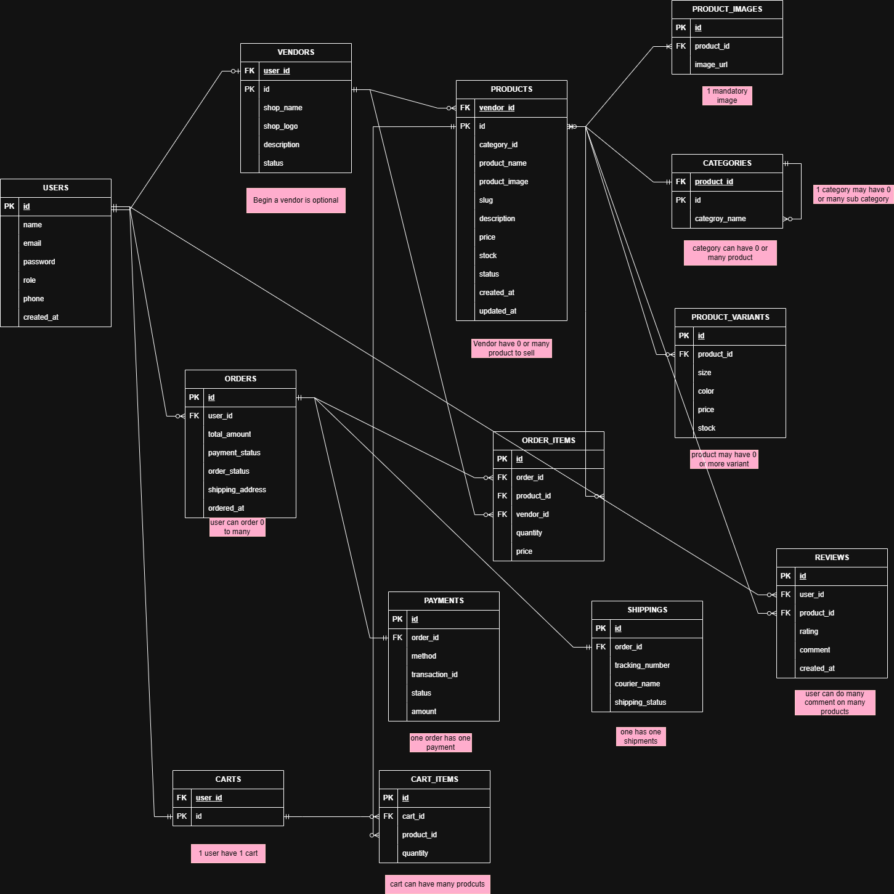
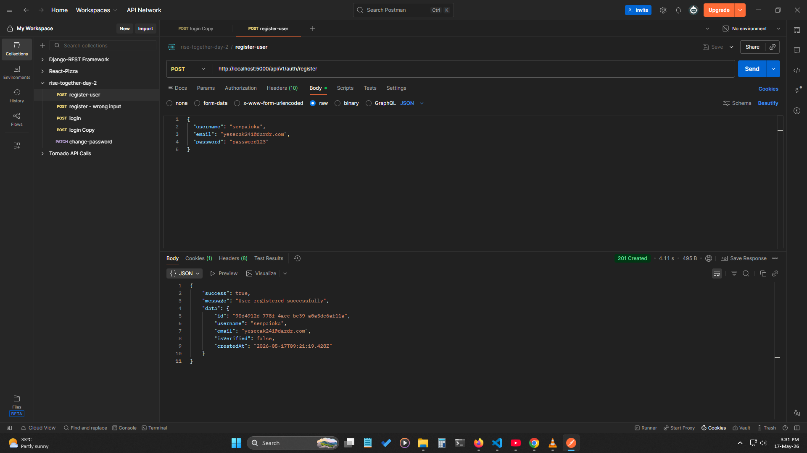
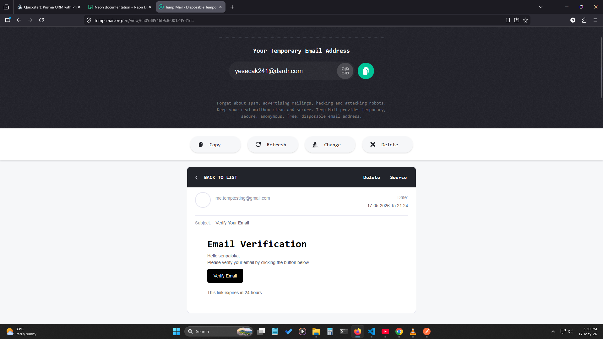
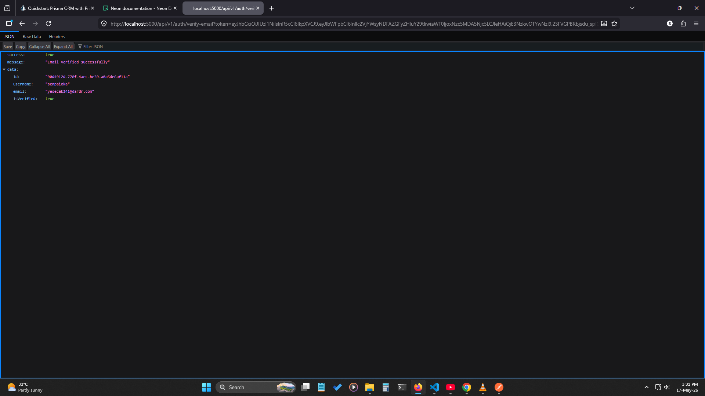
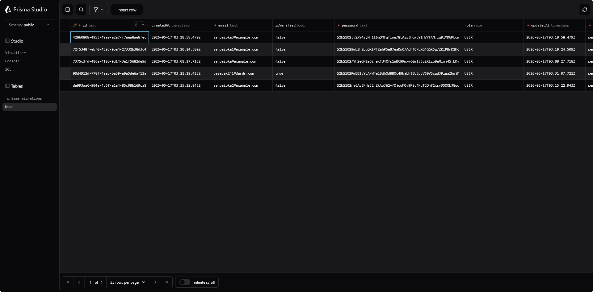
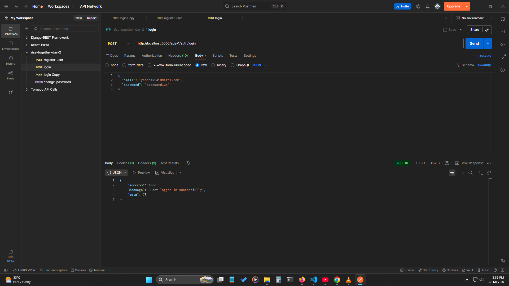

# Mongoose Projcet Link:
- Link: https://github.com/Senpaioka/-backend--express-mongoose-multi-vendor-api

# Prisma & Neondb Project Link:
- Link: https://github.com/Senpaioka/backend-expressjs-with-prisma-and-neon-DB

# Prisma ORM Questions & Answers

## 1. What is Prisma ORM and why is it used in backend development?
**Prisma ORM** is a modern ORM (Object Relational Mapper) for databases.

It helps backend developers:

- Connect apps to databases easily
- Write database queries using JavaScript/TypeScript instead of raw SQL
- Improve type safety and developer productivity
- Manage database schema and migrations

Example:
```js
const users = await prisma.user.findMany()
```
Instead of writing:
```sql
SELECT * FROM users;
```

## 2. Difference between findUnique() and findFirst() in Prisma
### `findUnique()`
- Finds one record using a unique field
- Works only with fields marked @id or @unique

Example:
```js
const user = await prisma.user.findUnique({
  where: { email: "test@gmail.com" }
})
```
Use when:
- Searching by id, email, etc.

### `findFirst()`
- Finds the first matching record
- Can use any field

Example:
```js
const user = await prisma.user.findFirst({
  where: { role: "ADMIN" }
})
```
Use when:
- Multiple records may match
- You only need the first one

## 3. What is Prisma Migration and why is prisma migrate dev used?
A Prisma Migration is a way to track and apply database changes.

Example changes:
- Create tables
- Add columns
- Update relationships

Command:
```
npx prisma migrate dev
```
It:
- Creates a migration file
- Updates the database
- Regenerates Prisma Client

Used during development to keep the database synced with the Prisma schema.

## 4. Difference between select and include in Prisma
### `select`
Used to choose specific fields.

Example:
```js
const user = await prisma.user.findUnique({
  where: { id: 1 },
  select: {
    name: true,
    email: true
  }
})
```
Returns:
```json
{
  "name": "John",
  "email": "john@gmail.com"
}
```

### `include`

Used to include related data (relations).

Example:
```js
const user = await prisma.user.findUnique({
  where: { id: 1 },
  include: {
    posts: true
  }
})
```
Returns:
```json
{
  "id": 1,
  "name": "John",
  "posts": [...]
}
```

Simple Difference:
- select → specific fields
- include → related models/data


## 5. Purpose of schema.prisma and its main sections
The schema.prisma file is the main configuration file in Prisma.

It defines:
- Database connection
- Database models
- Prisma client settings

### Main sections:

### 1. Generator
Generates Prisma Client.

```prisma
generator client {
  provider = "prisma-client-js"
}
```

### 2. Datasource
Database connection setup.
```prisma
datasource db {
  provider = "postgresql"
  url      = env("DATABASE_URL")
}
```

### 3. Models
Defines database tables and relationships.
```prisma
model User {
  id    Int    @id @default(autoincrement())
  name  String
  email String @unique
}
```
These models become tables in the database.

<br>

# Database Interview Questions & Answers

---
## 1. Difference between `DELETE`, `TRUNCATE`, `DROP` ?

| Command    | What it does             | Can use WHERE? | Structure removed? | Rollback possible?*                    |
| ---------- | ------------------------ | -------------- | ------------------ | -------------------------------------- |
| `DELETE`   | Removes selected rows    | Yes            | No                 | Yes                                    |
| `TRUNCATE` | Removes all rows quickly | No             | No                 | Yes in PostgreSQL                      |
| `DROP`     | Deletes entire table     | No             | Yes                | Yes in PostgreSQL (inside transaction) |


## 2. What is a PRIMARY KEY?

A `PRIMARY KEY` is a column (or columns) that uniquely identifies each row in a table.

Rules:

- Cannot contain NULL
- Must be unique
- Only one primary key per table

**Example**
```sql
CREATE TABLE students (
    id SERIAL PRIMARY KEY,
    name VARCHAR(100)
);
```

## 3. Difference between PRIMARY KEY and UNIQUE KEY
| PRIMARY KEY              | UNIQUE KEY              |
| ------------------------ | ----------------------- |
| Uniquely identifies rows | Also ensures uniqueness |
| Cannot contain NULL      | Can contain NULL        |
| Only one per table       | Multiple allowed        |


## 4. What is a FOREIGN KEY?
A `FOREIGN KEY` creates a relationship between two tables.

It ensures that values exist in the referenced table.

**Example**
```sql
CREATE TABLE departments (
    id SERIAL PRIMARY KEY,
    name TEXT
);

CREATE TABLE employees (
    id SERIAL PRIMARY KEY,
    dept_id INT,
    FOREIGN KEY (dept_id)
    REFERENCES departments(id)
);
```

## 5. What is JOIN in SQL?
`JOIN` is used to combine data from multiple tables.

### INNER JOIN
Returns matching rows from both tables.
```sql
SELECT employees.name, departments.name
FROM employees
INNER JOIN departments
ON employees.dept_id = departments.id;
```

### LEFT JOIN
Returns all rows from left table and matched rows from right table.
```sql
SELECT employees.name, departments.name
FROM employees
LEFT JOIN departments
ON employees.dept_id = departments.id;
```

## 6. What is normalization?

Normalization organizes data to reduce duplication and improve consistency.

### 1NF (First Normal Form)
- No repeating groups
- Each column has single value

Bad:
```
Phones: 123,456
```
Good:
```
Phone: 123
Phone: 456
```

### 2NF (Second Normal Form)
- Must be in 1NF
- No partial dependency

Every non-key column must depend on the whole primary key.

### 3NF (Third Normal Form)
- Must be in 2NF
- No transitive dependency

Non-key columns should depend only on primary key.


## 7. What is indexing?

An `INDEX` improves query speed.

Without index:
- PostgreSQL scans whole table

With index:
- PostgreSQL finds data faster

Why use index?
- Faster SELECT
- Faster searching/filtering
- Faster joins

**Example**
```sql
CREATE INDEX idx_employee_name
ON employees(name);
```

## 8. Difference between WHERE and HAVING
| WHERE                                   | HAVING                        |
| --------------------------------------- | ----------------------------- |
| Filters rows before grouping            | Filters groups after grouping |
| Cannot use aggregate functions directly | Used with aggregate functions |

**Example using `WHERE`**:
```sql
SELECT * FROM employees
WHERE salary > 50000;
```

**Example using `HAVING`**
```sql
SELECT dept_id, COUNT(*)
FROM employees
GROUP BY dept_id
HAVING COUNT(*) > 5;
```

## 9. What is a transaction in SQL?
A transaction is a group of SQL operations executed together.

Used to maintain data consistency.

### COMMIT
Saves changes permanently.
```sql
COMMIT;
```

### ROLLBACK
Undoes changes.
```sql
ROLLBACK;
```

**Example**
```sql
BEGIN;

UPDATE accounts
SET balance = balance - 100
WHERE id = 1;

UPDATE accounts
SET balance = balance + 100
WHERE id = 2;

COMMIT;
```

## 10. Query to find the second highest salary
```sql
SELECT DISTINCT salary
FROM employees
ORDER BY salary DESC
OFFSET 1
LIMIT 1;
```
Alternative:
```sql
SELECT MAX(salary)
FROM employees
WHERE salary < (
    SELECT MAX(salary)
    FROM employees
);
```


---
---

## 1. What is the difference between Primary Key and Foreign Key?

### Primary Key
- Uniquely identifies each row in a table
- Cannot be NULL
- One primary key per table

### Foreign Key
- Creates relationship between tables
- References a primary key in another table
- Can contain duplicate values

### Example
```sql
Users(id PRIMARY KEY)

Orders(user_id FOREIGN KEY REFERENCES Users(id))
```

## 2. Why is normalization important?

Normalization reduces:

- Data duplication
- Inconsistent data
- Update problems

It organizes data into related tables for better integrity and maintenance.

## 3. What is a JOIN?

A JOIN combines data from multiple tables using related columns.

**Example**
```sql
SELECT users.name, orders.total
FROM users
JOIN orders
ON users.id = orders.user_id;
```

## 4. Difference between SQL and MongoDB?

| SQL                 | MongoDB                  |
| ------------------- | ------------------------ |
| Relational database | NoSQL database           |
| Uses tables         | Uses collections         |
| Fixed schema        | Flexible schema          |
| Uses SQL queries    | Uses JSON-like documents |


## 5. What is a composite key?

A composite key uses multiple columns together to uniquely identify a row.

**Example**
```sql
PRIMARY KEY(student_id, course_id)
```

## 6. What is a weak entity?

A weak entity cannot exist without another entity.

**Example**
- Order Item depends on Order
- Without Order, Order Item has no meaning

## 7. Why do we use constraints?

Constraints enforce rules on database data.

**Common Constraints**
- PRIMARY KEY
- FOREIGN KEY
- UNIQUE
- NOT NULL

They improve data integrity and consistency.

## 8. Explain many-to-many relationship.

A `many-to-many` relationship occurs when:

- One record relates to many records
- And vice versa

**Example**
- Students ↔ Courses

A junction table is usually used:
```sql
student_course(student_id, course_id)
```

## 9. What is the difference between Clustered and Non-Clustered Index?

| Clustered Index          | Non-Clustered Index          |
| ------------------------ | ---------------------------- |
| Sorts actual table data  | Separate structure from data |
| Only one per table       | Multiple allowed             |
| Faster for range queries | Faster for lookups           |

## 10. Explain Database Sharding and Partitioning. When would you use each?
### Partitioning

Splits a large table into smaller parts inside the same database server.

Used for:

- Large tables
- Better query performance

### Sharding

Splits data across multiple database servers.

Used for:

- Very large-scale applications
- Horizontal scaling

**Example**

- Users A–M → Server 1
- Users N–Z → Server 2


# Database ERD (Using Mermaid)


<br>

# Database ERD (`NEW` Manually Done)


# Express TypeScript REST API

A modular REST API boilerplate built with **Express.js** and **TypeScript**, featuring a clean folder structure, input validation, and cookie-based authentication scaffolding.


**Preview Link**: 


---

## Tech Stack

| Tool | Purpose |
|---|---|
| [Node.js](https://nodejs.org/) | Runtime |
| [Express.js v5](https://expressjs.com/) | Web framework |
| [TypeScript](https://www.typescriptlang.org/) | Type safety |
| [Zod](https://zod.dev/) | Schema validation |
| [dotenv](https://github.com/motdotla/dotenv) | Environment variables |
| [cookie-parser](https://github.com/expressjs/cookie-parser) | Cookie handling |
| [cors](https://github.com/expressjs/cors) | Cross-origin resource sharing |
| [tsx](https://github.com/privatenumber/tsx) | TypeScript execution & dev watcher |
| [pnpm](https://pnpm.io/) | Package manager |

---

## Project Structure

```
src/
├── app/
│   ├── auth/
│   │   ├── auth.controller.ts   # Request handlers for auth routes
│   │   ├── auth.routes.ts       # Auth route definitions
│   │   ├── auth.service.ts      # Business logic (to be implemented)
│   │   └── auth.validation.ts   # Zod schemas & inferred TypeScript types
│   └── routes/
│       └── routers.ts           # Central router — mounts all feature modules
├── config/
│   └── env.ts                   # Environment variable config (dotenv)
├── types/                       # Shared TypeScript types (to be added)
├── app.ts                       # Express app setup & global middleware
└── server.ts                    # HTTP server bootstrap & process signal handling
```

---

## Getting Started

### Prerequisites

- Node.js >= 18
- pnpm >= 11

### Installation

```bash
pnpm install
```

### Environment Variables

Create a `.env` file in the root directory:

```env
PORT=3000
```

### Running the Server

```bash
# Development (with hot reload)
pnpm dev

# Build
pnpm build

# Production
pnpm start
```

---

## API Endpoints

Base URL: `/api/v1`

### Health Check

| Method | Endpoint | Description |
|--------|----------|-------------|
| GET | `/` | Server health check |

### Auth

| Method | Endpoint | Description |
|--------|----------|-------------|
| POST | `/api/v1/auth/register` | Register a new user |
| POST | `/api/v1/auth/login` | Login with email & password |
| PATCH | `/api/v1/auth/change-password` | Change user password |
| POST | `/api/v1/auth/forgot-password` | Request a password reset link |

---

## Request & Response

### POST `/api/v1/auth/register`

**Request Body**
```json
{
  "username": "johndoe",
  "email": "john@example.com",
  "password": "secret123"
}
```

**Response**
```json
{
  "success": true,
  "message": "User registered successfully",
  "data": {
    "username": "johndoe",
    "email": "john@example.com"
  }
}
```





---

<br>

### POST `/api/v1/auth/login`

**Request Body**
```json
{
  "email": "john@example.com",
  "password": "secret123"
}
```

**Response**
```json
{
  "success": true,
  "message": "User logged in successfully",
  "data": {
    "email": "john@example.com"
  }
}
```



---

### PATCH `/api/v1/auth/change-password`

**Request Body**
```json
{
  "oldPassword": "secret123",
  "newPassword": "newSecret456",
  "confirmPassword": "newSecret456"
}
```

**Response**
```json
{
  "success": true,
  "message": "Password changed successfully"
}
```

---

### POST `/api/v1/auth/forgot-password`

**Request Body**
```json
{
  "email": "john@example.com"
}
```

**Response**
```json
{
  "success": true,
  "message": "Password reset link sent successfully",
  "data": {
    "email": "john@example.com",
    "resetToken": "..."
  }
}
```

---

## Validation

All request bodies are validated using [Zod](https://zod.dev/). On validation failure, the API returns:

```json
{
  "success": false,
  "errors": [
    {
      "code": "too_small",
      "path": ["password"],
      "message": "Password must be at least 6 characters"
    }
  ]
}
```

---

## Architecture Notes

- **Modular routing** — each feature module owns its routes, controller, service, and validation. The central `routers.ts` mounts them all.
- **Controller → Service pattern** — controllers handle HTTP concerns (parsing, validation, response). Business logic belongs in the service layer.
- **Cookie-based auth** — tokens are set as `httpOnly` cookies on login/register.
- **Global error handling** — a catch-all error middleware in `app.ts` handles unexpected errors. 404s are handled by a dedicated not-found middleware.
- **Process signal handling** — `server.ts` handles `SIGTERM`, `uncaughtException`, and `unhandledRejection` for graceful shutdown.
