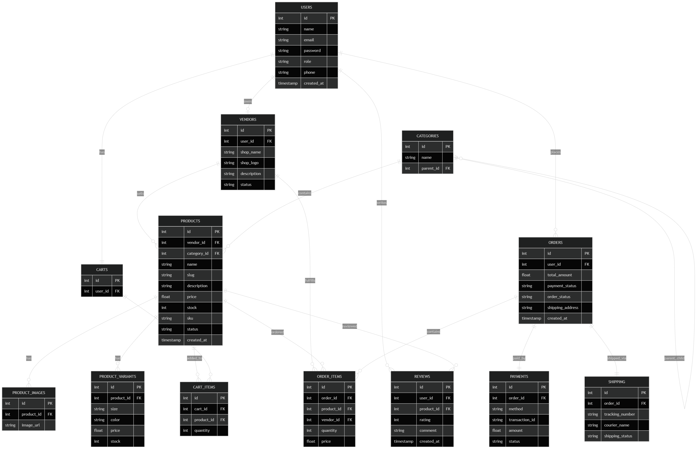

# Database Interview Questions & Answers

---

## 1. What is the difference between Primary Key and Foreign Key?

### Primary Key
- Uniquely identifies each row in a table
- Cannot be NULL
- One primary key per table

### Foreign Key
- Creates relationship between tables
- References a primary key in another table
- Can contain duplicate values

### Example
```sql
Users(id PRIMARY KEY)

Orders(user_id FOREIGN KEY REFERENCES Users(id))
```

## 2. Why is normalization important?

Normalization reduces:

- Data duplication
- Inconsistent data
- Update problems

It organizes data into related tables for better integrity and maintenance.

## 3. What is a JOIN?

A JOIN combines data from multiple tables using related columns.

**Example**
```sql
SELECT users.name, orders.total
FROM users
JOIN orders
ON users.id = orders.user_id;
```

## 4. Difference between SQL and MongoDB?

| SQL                 | MongoDB                  |
| ------------------- | ------------------------ |
| Relational database | NoSQL database           |
| Uses tables         | Uses collections         |
| Fixed schema        | Flexible schema          |
| Uses SQL queries    | Uses JSON-like documents |


## 5. What is a composite key?

A composite key uses multiple columns together to uniquely identify a row.

**Example**
```sql
PRIMARY KEY(student_id, course_id)
```

## 6. What is a weak entity?

A weak entity cannot exist without another entity.

**Example**
- Order Item depends on Order
- Without Order, Order Item has no meaning

## 7. Why do we use constraints?

Constraints enforce rules on database data.

**Common Constraints**
- PRIMARY KEY
- FOREIGN KEY
- UNIQUE
- NOT NULL

They improve data integrity and consistency.

## 8. Explain many-to-many relationship.

A `many-to-many` relationship occurs when:

- One record relates to many records
- And vice versa

**Example**
- Students ↔ Courses

A junction table is usually used:
```sql
student_course(student_id, course_id)
```

## 9. What is the difference between Clustered and Non-Clustered Index?

| Clustered Index          | Non-Clustered Index          |
| ------------------------ | ---------------------------- |
| Sorts actual table data  | Separate structure from data |
| Only one per table       | Multiple allowed             |
| Faster for range queries | Faster for lookups           |

## 10. Explain Database Sharding and Partitioning. When would you use each?
### Partitioning

Splits a large table into smaller parts inside the same database server.

Used for:

- Large tables
- Better query performance

### Sharding

Splits data across multiple database servers.

Used for:

- Very large-scale applications
- Horizontal scaling

**Example**

- Users A–M → Server 1
- Users N–Z → Server 2


# Database ERD




# Express TypeScript REST API

A modular REST API boilerplate built with **Express.js** and **TypeScript**, featuring a clean folder structure, input validation, and cookie-based authentication scaffolding.


**Preview Link**: 


---

## Tech Stack

| Tool | Purpose |
|---|---|
| [Node.js](https://nodejs.org/) | Runtime |
| [Express.js v5](https://expressjs.com/) | Web framework |
| [TypeScript](https://www.typescriptlang.org/) | Type safety |
| [Zod](https://zod.dev/) | Schema validation |
| [dotenv](https://github.com/motdotla/dotenv) | Environment variables |
| [cookie-parser](https://github.com/expressjs/cookie-parser) | Cookie handling |
| [cors](https://github.com/expressjs/cors) | Cross-origin resource sharing |
| [tsx](https://github.com/privatenumber/tsx) | TypeScript execution & dev watcher |
| [pnpm](https://pnpm.io/) | Package manager |

---

## Project Structure

```
src/
├── app/
│   ├── auth/
│   │   ├── auth.controller.ts   # Request handlers for auth routes
│   │   ├── auth.routes.ts       # Auth route definitions
│   │   ├── auth.service.ts      # Business logic (to be implemented)
│   │   └── auth.validation.ts   # Zod schemas & inferred TypeScript types
│   └── routes/
│       └── routers.ts           # Central router — mounts all feature modules
├── config/
│   └── env.ts                   # Environment variable config (dotenv)
├── types/                       # Shared TypeScript types (to be added)
├── app.ts                       # Express app setup & global middleware
└── server.ts                    # HTTP server bootstrap & process signal handling
```

---

## Getting Started

### Prerequisites

- Node.js >= 18
- pnpm >= 11

### Installation

```bash
pnpm install
```

### Environment Variables

Create a `.env` file in the root directory:

```env
PORT=3000
```

### Running the Server

```bash
# Development (with hot reload)
pnpm dev

# Build
pnpm build

# Production
pnpm start
```

---

## API Endpoints

Base URL: `/api/v1`

### Health Check

| Method | Endpoint | Description |
|--------|----------|-------------|
| GET | `/` | Server health check |

### Auth

| Method | Endpoint | Description |
|--------|----------|-------------|
| POST | `/api/v1/auth/register` | Register a new user |
| POST | `/api/v1/auth/login` | Login with email & password |
| PATCH | `/api/v1/auth/change-password` | Change user password |
| POST | `/api/v1/auth/forgot-password` | Request a password reset link |

---

## Request & Response

### POST `/api/v1/auth/register`

**Request Body**
```json
{
  "username": "johndoe",
  "email": "john@example.com",
  "password": "secret123"
}
```

**Response**
```json
{
  "success": true,
  "message": "User registered successfully",
  "data": {
    "username": "johndoe",
    "email": "john@example.com"
  }
}
```

---

### POST `/api/v1/auth/login`

**Request Body**
```json
{
  "email": "john@example.com",
  "password": "secret123"
}
```

**Response**
```json
{
  "success": true,
  "message": "User logged in successfully",
  "data": {
    "email": "john@example.com"
  }
}
```

---

### PATCH `/api/v1/auth/change-password`

**Request Body**
```json
{
  "oldPassword": "secret123",
  "newPassword": "newSecret456",
  "confirmPassword": "newSecret456"
}
```

**Response**
```json
{
  "success": true,
  "message": "Password changed successfully"
}
```

---

### POST `/api/v1/auth/forgot-password`

**Request Body**
```json
{
  "email": "john@example.com"
}
```

**Response**
```json
{
  "success": true,
  "message": "Password reset link sent successfully",
  "data": {
    "email": "john@example.com",
    "resetToken": "..."
  }
}
```

---

## Validation

All request bodies are validated using [Zod](https://zod.dev/). On validation failure, the API returns:

```json
{
  "success": false,
  "errors": [
    {
      "code": "too_small",
      "path": ["password"],
      "message": "Password must be at least 6 characters"
    }
  ]
}
```

---

## Architecture Notes

- **Modular routing** — each feature module owns its routes, controller, service, and validation. The central `routers.ts` mounts them all.
- **Controller → Service pattern** — controllers handle HTTP concerns (parsing, validation, response). Business logic belongs in the service layer.
- **Cookie-based auth** — tokens are set as `httpOnly` cookies on login/register.
- **Global error handling** — a catch-all error middleware in `app.ts` handles unexpected errors. 404s are handled by a dedicated not-found middleware.
- **Process signal handling** — `server.ts` handles `SIGTERM`, `uncaughtException`, and `unhandledRejection` for graceful shutdown.
